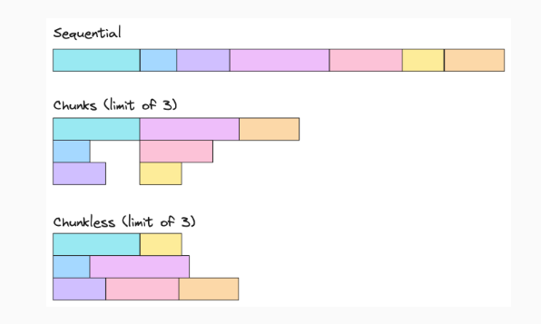

# Map Async Limit

实现一个函数，传入一个参数数组，以及一个异步函数，返回一个`Promise`

执行该参数时，可以带入一个可选参数`size`，这是同时并发最大请求数。如果该参数没有被指定，那么并发数量无限制

## Example

```ts
async function fetchUpperCase(q: string) {
  // Fake API service that converts a string to uppercase.
  const res = await fetch('https://uppercase.com?q=' + encodeURIComponent(q));
  return await res.text();
}

// Only a maximum of 2 pending requests at any one time.
const results = await mapAsyncLimit(
  ['foo', 'bar', 'qux', 'quz'],
  fetchUpperCase,
  2,
);
console.log(results); // ['FOO', 'BAR', 'QUX', 'QUZ'];

```

## Solution

一般的想法是使用传入的`size`大小将输入数组进行切割为一个`chunk`，然后一次并发处理一个`chunk`。这个解决办法可以使用`Prmise.all`来进行处理

### 方法 1: 顺序请求(Bad!)

这个方法忽略了参数`size`，一个一个的处理每一个异步请求，必须前一次请求完毕才能进行下一次请求

```ts
export default function mapAsyncLimit<T, U>(
  iterable: Array<T>,
  callbackFn: (value: T) => Promise<U>,
  size: number,
): Promise<Array<U>> {
  return new Promise((resolve, reject) => {
    const results: Array<U> = [];

    function processItem(index: number) {
      if (index === iterable.length) {
        resolve(results);
      }

      return callbackFn(iterable[index])
        .then((result) => {
          results.push(result);
          processItem(index + 1);
        })
        .catch(reject);
    }

    return processItem(0);
  });
}
```

### 方法 2：按`chunks`循环执行

- 使用`Promise.all`对`chunks`进行并发处理
- 递归调用`mapAsyncLimit`函数处理剩余数据

```ts
export default function mapAsyncLimit<T, U>(
  iterable: Array<T>,
  callbackFn: (value: T) => Promise<U>,
  size: number,
): Promise<Array<U>> {
  if(iterable.length === 0) {
    return Promise.resolve([]);
  }

  const currentChunk = iterable.slice(0, size);
  const remainingItems = iterable.slice(size);

  return Promise.all(currentChunk.map(callbackFn)).then((results) => {
    return mapAsyncLimit(remainingItems, callbackFn, size).then((remainingResults) => {
      return [...results, ...remainingResults];
    });
  });
}
```

### 方法 3：使用`async/await`来执行`chunks`

```ts
export default function mapAsyncLimit<T, U>(
  iterable: Array<T>,
  callbackFn: (value: T) => Promise<U>,
  size: number,
): Promise<Array<U>> {
  const results: Array<U> = [];
  const chunks = size || 1;

  for(let i = 0; i < iterable.length; i += chunks) {
    const currentChunk = iterable.slice(i, i + chunks);
    const chunkResults = await Promise.all(currentChunk.map(callbackFn));

    results.push(...chunkResults);
  }

  return results;
}
```

### 方法 4：最大并发数 `Chunkless`

之前的方法有一个缺点，就是会出现一个空余时间，并且可用并发上线没有得到充分利，如下图：


- 顺序请求：顺序请求一定能够确保请求数在并发限制`size`内，但是由于需要等待前面请求的返回之后再请求下一个，所以时间是很慢的
- `Chunks`：`Chunks`方法提高了同时并发的请求数量，但是在前一个`chunks`的所有请求完成之前，不能进行下一次的请求，如果一个`chunks`内有一个比较慢的请求，那么会阻塞下一次的请求
- `Chunkless`：最有效的方式就是同时并发`size`大小的请求，并且当里面有任务完成时，进行下一个异步操作

```ts
export default function mapAsyncLimit<T, U>(
  iterable: Array<T>,
  callbackFn: (value: T) => Promise<U>,
  size: number
): Promise<Array<U>> {
  return new Promise(resolve, reject) => {
    const results: Array<U> = [];
    let nextIndex = 0;
    let resolved = 0;
    
    if(iterable.length === 0) {
      resolve(results);
      return;
    }

    function processItem(index: number) {
      nextIndex++;
      callbackFn(iterable[index]).then((value) => {
        results[index] = value;
        resolved++;
        if(resolved === iterable.length) {
          resolve(results);
          return;
        }
        if(nextIndex < iterable.length) {
          processItem(nextIndex);
        }
      }).catch(reject);
    }

    for(let i = 0; i < size && i < iterable.length; i++) {
      processItem(i);
    }
  });
}
```
