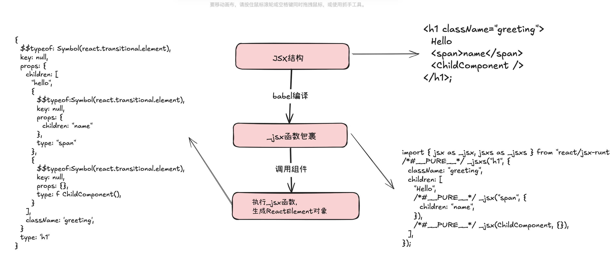

# React原理之JSX

`JSX`是`JavaScript`的扩展语法，主要用于`React`框架中描述`UI`结构

## JSX 与 HTML 的区别

1. 属性命名：使用`camelCase`而非`HTML`属性名
2. 样式设置：使用对象而非字符串
3. 内部可以嵌入表达式

## 底层原理

`JSX`语法通过`babel`编译为使用`React.createElement`函数或者`_jsx`函数包裹的层级结构，以此来简化页面编写的复杂度，提高开发效率，`createElement`以及`_jsx`函数会返回生成的`Element`对象，该对象是对页面结构的描述

```js
// JSX
const element = <h1 className="greeting">Hello</h1>;

// 编译为
const element = React.createElement("h1", { className: "greeting" }, "Hello");

// jsx
<h1 className="greeting">
  Hello
  <span>name</span>
  <ChildComponent />
</h1>;

// 编译为
import { jsx as _jsx, jsxs as _jsxs } from "react/jsx-runtime";
/*#__PURE__*/ _jsxs("h1", {
  className: "greeting",
  children: [
    "Hello",
    /*#__PURE__*/ _jsx("span", {
      children: "name",
    }),
    /*#__PURE__*/ _jsx(ChildComponent, {}),
  ],
});
```

`_jsx`函数在`react`源码中的`packages/react/src/jsx/ReactJSX.js`文件中，可以看到在`jsxProd`函数中调用了`ReactElement`函数来创建`ReactElement`对象，该对象的结构如下：

```js
element = {
  // This tag allows us to uniquely identify this as a React Element
  $$typeof: REACT_ELEMENT_TYPE,

  // Built-in properties that belong on the element
  type,
  key,

  props,

  // Record the component responsible for creating this element.
  _owner: owner,
};
```

上面的`JSX`经过`babel`编译后，再经过`_jsx`函数，就会生成如下`ReactElement`结构的对象，用来描述当前页面结构

```js
/*#__PURE__*/ _jsxs("h1", {
  className: "greeting",
  children: [
    "Hello",
    /*#__PURE__*/ _jsx("span", {
      children: "name",
    }),
    /*#__PURE__*/ _jsx(ChildComponent, {}),
  ],
});
// ReactElement对象
{
  $$typeof: Symbol(react.transitional.element),
  key: null,
  props: {
    children: [
      "hello",
      {
        $$typeof:Symbol(react.transitional.element),
        key: null,
        props: {
          children: "name"
        },
        type: "span"
      },
      {
        $$typeof:Symbol(react.transitional.element),
        key: null,
        props: {},
        type: f ChildComponent(), // 函数组件的函数引用
      }
    ],
    className: 'greeting',
  }
  type: 'h1'
}
```

上面的属性主要含义如下：

- `$$typeof`：使用`Symbol`对象唯一标识一个`ReactElement`元素，主要值为`REACT_ELEMENT_TYPE`
- `key`：元素的`key`
- `props`：存储元素的其他属性
  - `children`：元素的子元素
  - `className`：元素类
- `type`：组件类型，如果是一个标签则为标签名，如果是一个**函数组件**，则为该**函数**

```js
export const REACT_ELEMENT_TYPE: symbol = renameElementSymbol
  ? Symbol.for("react.transitional.element")
  : REACT_LEGACY_ELEMENT_TYPE;
```

整体流程大致如下：


## 从 render 开始

上面主要介绍了`JSX`在`react`是怎么进行编译和使用的，那么当我们在项目中定义了一个`App`组件，并且使用`createRoot(document.getElementById("root")!).render(<App />);`来进行渲染时，主要都发生了什么呢？

定义如下组件

```jsx
// App.tsx
function ChildComponent() {
  return <h2>子组件</h2>;
}

function App() {
  return (
    <h1 className="greeting">
      Hello
      <span>name</span>
      <ChildComponent />
    </h1>
  );
}

export default App;

// main.tsx
import { createRoot } from "../packages/react-dom/client";
import App from "./App.tsx";

createRoot(document.getElementById("root")!).render(<App />);
```

在上面的`createRoot`函数中，会拿到传入的`dom`来创建一个`root`容器，然后返回响应的`render`以及`unmount`函数，在`render`函数中，传入的`<App />`会被进行编译

```js
// jsx
<App />

// babel编译后
import { jsx as _jsx } from "react/jsx-runtime";
/*#__PURE__*/_jsx(App, {});

// 相当于main页面如下：
import { createRoot } from "../packages/react-dom/client";
import { jsx as _jsx } from "react/jsx-runtime";
import App from "./App.tsx";

createRoot(document.getElementById("root")!).render(_jsx(App, {}));
```

`_jsx(App, {})`会生成如下`ReactElement`元素，传入给`render`函数进行后续的`FiberNode`创建

```js
{
  $$typeof:Symbol(react.transitional.element),
  key: null,
  props: {},
  type: f App(), // 函数组件的函数引用
}
```

该函数组件函数会在后期的`reconciler`过程中进行执行，拿到返回的子元素，并且递归的获取子元素的`ReactElement`创建`FiberNode`来生成`FiberNodeTree`，这些内容会在后面进行分析

下一遍，介绍`Fiber`的创建过程
