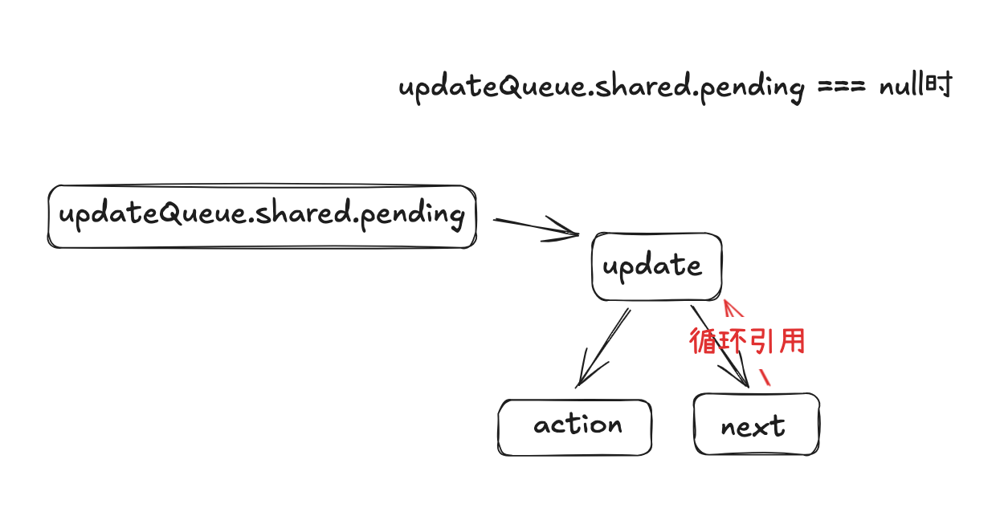

# React 原理之 Fiber

## 创建`FiberRootNode`

在渲染页面时使用了下面方法来进行`JSX`与`DOM`容器的关联

```ts
createRoot(document.getElementById("root")!).render(<App />);
```

详细进入`createRoot`可以看到：

```ts
export function createRoot(container) {
  const root = createContainer(container);
  return {
    render(element) {
      return updateContainer(element, root);
    },
  };
}
```

可以看到主要执行了两个方法，就完成了`JSX`的转换以及`DOM`树的渲染过程，那么是过程是怎么样的呢，下面 👇🏻 我们分步骤来进行解析，首先进入`createContainer`方法

```ts
export function createContainer(container: Container) {
  const hostRootFiber = new FiberNode(HostRoot, {}, null);
  const root = new FiberRootNode(container, hostRootFiber);
  hostRootFiber.updateQueue = createUpdateQueue<ReactElement>();
  return root;
}
```

在上面的方法中可以看到，主要是创建了两个实例，一个是`hostRootFiber`，一个是`root`，并且调用`createUpdateQueue`创建了一个更新队列，就是返回了一个结构为`{ shared: { pending: null }}`的对象，该对象的值现在为`null`，后期在第二阶段会将其指向为需要更新的`<App />`

```ts
export const createUpdateQueue = <Action>() => {
  const updateQueue: UpdateQueue<Action> = {
    shared: {
      pending: null,
    },
    dispatch: null,
  };
  return updateQueue;
};
```

`hostRootFiber`是一个`FiberNode`的实例，其`type`值为`HostRoot`，也就是凭空创建了一个顶级的`FiberNode`节点

`root`是`FiberRootNode`的实例，在这个实例对象中，将`hostRootFiber`与`DOM`节点进行了关联，在内存中生成了如下数据模型


详细数据结构如下：

- `root`结构

```json
callbackNode:null
callbackPriority:0
container:div#root
current:FiberNode {tag: 3, key: null, stateNode: FiberRootNode, type: null, return: null, …}
finishedLanes:0
finishedWork:null
pendingLanes:0
pendingPassiveEffects:{unmount: Array(0), update: Array(0)}
```

- `hostRootFiber`结构

```json
alternate:null
child:null
deletions:null
flags:0
index:0
key:null
lanes:0
memoizedProps:null
memoizedState:null
pendingProps:{}
ref:null
return:null
sibling:null
stateNode:FiberRootNode {container: div#root, current: FiberNode, finishedWork: null, pendingPassiveEffects: {…}, pendingLanes: 0, …}
subtreeFlags:0
tag:3
type:null
updateQueue:{shared: {pending: null}}
```

## `updateContainer`

在创建了一个根`fiber`的`root`节点，并且将其与容器`DOM`进行关联之后，执行了`updateContainer`函数，在这个函数中将需要更新的`JSX`放入了更新队列`updateQueue`中，并使用的深度优先遍历进行子树的`FiberNode`的创建

```ts
export function updateContainer(
  element: ReactElement | null,
  root: FiberRootNode
) {
  const hostRootFiber = root.current;
  const update = createUpdate<ReactElement | null>(element, rootRenderPriority);
  enqueueUpdate(
    hostRootFiber.updateQueue as UpdateQueue<ReactElement | null>,
    update
  );
  scheduleUpdateOnFiber(hostRootFiber, rootRenderPriority);
  return element;
}
```

上面的`createUpdate`函数很简单，就是返回了一个对象，其中`action`指向需要更新的`ReactElement`元素，也就是`<App />`

```ts
action: {$$typeof: Symbol(react.element), key: null, ref: null, props: {…}, type: ƒ, …}
lane: 1
next: null
```

然后执行`enqueueUpdate`函数，该函数主要是将之前返回的`update`任务加入到更新队列中，此时由于是初次执行，所以`updateQueue.shared.pending`为`null`，执行后生成如下结构


然后执行调度方法进行调度`scheduleUpdateOnFiber`


