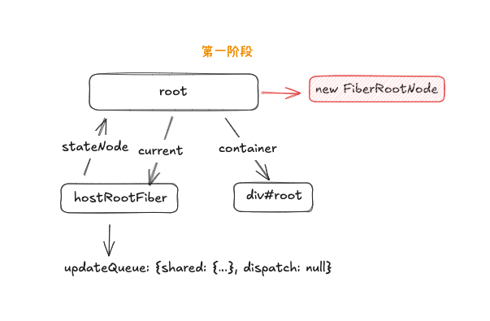
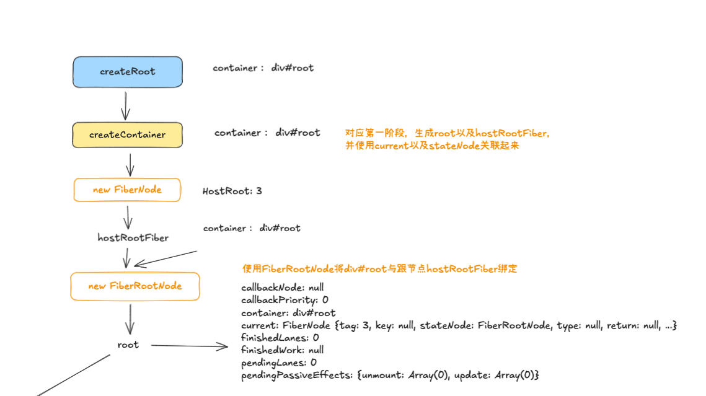

# React 原理之 Fiber

在渲染页面时使用了下面方法来进行`JSX`与`DOM`容器的关联

```ts
createRoot(document.getElementById("root")!).render(<App />);
```

详细进入`createRoot`可以看到：

```ts
export function createRoot(container) {
  const root = createContainer(container);
  return {
    render(element) {
      return updateContainer(element, root);
    },
  };
}
```

可以看到主要执行了两个方法，就完成了`JSX`的转换以及`DOM`树的渲染过程，那么是过程是怎么样的呢，下面 👇🏻 我们分步骤来进行解析，首先进入`createContainer`方法

```ts
export function createContainer(container: Container) {
  const hostRootFiber = new FiberNode(HostRoot, {}, null);
  const root = new FiberRootNode(container, hostRootFiber);
  hostRootFiber.updateQueue = createUpdateQueue<ReactElement>();
  return root;
}
```

在上面的方法中可以看到，主要是创建了两个实例，一个是`hostRootFiber`，一个是`root`，并且调用`createUpdateQueue`创建了一个更新队列，就是返回了一个结构为`{ shared: { pending: null }}`的对象，该对象的值现在为`null`，后期在第二阶段会将其指向为需要更新的`<App />`

```ts
export const createUpdateQueue = <Action>() => {
  const updateQueue: UpdateQueue<Action> = {
    shared: {
      pending: null,
    },
    dispatch: null,
  };
  return updateQueue;
};
```

`hostRootFiber`是一个`FiberNode`的实例，其`type`值为`HostRoot`，也就是凭空创建了一个顶级的`FiberNode`节点

`root`是`FiberRootNode`的实例，在这个实例对象中，将`hostRootFiber`与`DOM`节点进行了关联，在内存中生成了如下数据模型



