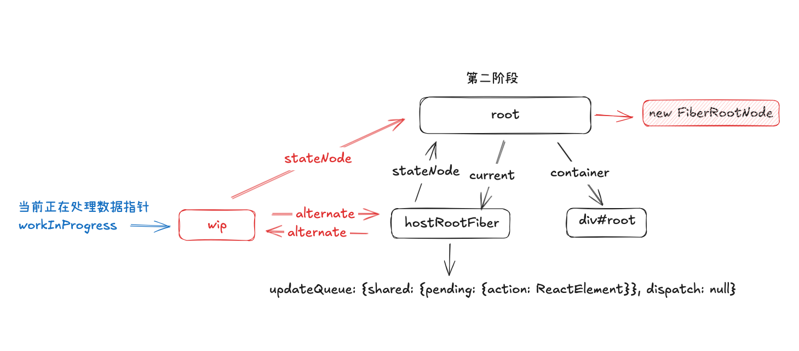
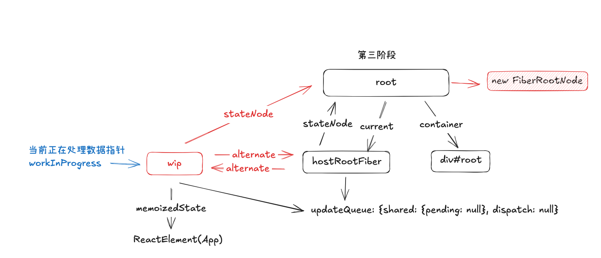

# React 原理之 Fiber

## 创建`FiberRootNode`

在渲染页面时使用了下面方法来进行`JSX`与`DOM`容器的关联

```ts
createRoot(document.getElementById("root")!).render(<App />);
```

详细进入`createRoot`可以看到：

```ts
export function createRoot(container) {
  const root = createContainer(container);
  return {
    render(element) {
      return updateContainer(element, root);
    },
  };
}
```

可以看到主要执行了两个方法，就完成了`JSX`的转换以及`DOM`树的渲染过程，那么是过程是怎么样的呢，下面 👇🏻 我们分步骤来进行解析，首先进入`createContainer`方法

```ts
export function createContainer(container: Container) {
  const hostRootFiber = new FiberNode(HostRoot, {}, null);
  const root = new FiberRootNode(container, hostRootFiber);
  hostRootFiber.updateQueue = createUpdateQueue<ReactElement>();
  return root;
}
```

在上面的方法中可以看到，主要是创建了两个实例，一个是`hostRootFiber`，一个是`root`，并且调用`createUpdateQueue`创建了一个更新队列，就是返回了一个结构为`{ shared: { pending: null }}`的对象，该对象的值现在为`null`，后期在第二阶段会将其指向为需要更新的`<App />`

```ts
export const createUpdateQueue = <Action>() => {
  const updateQueue: UpdateQueue<Action> = {
    shared: {
      pending: null,
    },
    dispatch: null,
  };
  return updateQueue;
};
```

`hostRootFiber`是一个`FiberNode`的实例，其`type`值为`HostRoot`，也就是凭空创建了一个顶级的`FiberNode`节点

`root`是`FiberRootNode`的实例，在这个实例对象中，将`hostRootFiber`与`DOM`节点进行了关联，在内存中生成了如下数据模型


详细数据结构如下：

- `root`结构

```json
callbackNode:null
callbackPriority:0
container:div#root
current:FiberNode {tag: 3, key: null, stateNode: FiberRootNode, type: null, return: null, …}
finishedLanes:0
finishedWork:null
pendingLanes:0
pendingPassiveEffects:{unmount: Array(0), update: Array(0)}
```

- `hostRootFiber`结构

```json
alternate:null
child:null
deletions:null
flags:0
index:0
key:null
lanes:0
memoizedProps:null
memoizedState:null
pendingProps:{}
ref:null
return:null
sibling:null
stateNode:FiberRootNode {container: div#root, current: FiberNode, finishedWork: null, pendingPassiveEffects: {…}, pendingLanes: 0, …}
subtreeFlags:0
tag:3
type:null
updateQueue:{shared: {pending: null}}
```

## `updateContainer`

在创建了一个根`fiber`的`root`节点，并且将其与容器`DOM`进行关联之后，执行了`updateContainer`函数，在这个函数中将需要更新的`JSX`放入了更新队列`updateQueue`中，并使用的深度优先遍历进行子树的`FiberNode`的创建

```ts
export function updateContainer(
  element: ReactElement | null,
  root: FiberRootNode
) {
  const hostRootFiber = root.current;
  const update = createUpdate<ReactElement | null>(element, rootRenderPriority);
  enqueueUpdate(
    hostRootFiber.updateQueue as UpdateQueue<ReactElement | null>,
    update
  );
  scheduleUpdateOnFiber(hostRootFiber, rootRenderPriority);
  return element;
}
```

上面的`createUpdate`函数很简单，就是返回了一个对象，其中`action`指向需要更新的`ReactElement`元素，也就是`<App />`

```ts
action: {$$typeof: Symbol(react.element), key: null, ref: null, props: {…}, type: ƒ, …}
lane: 1
next: null
```

然后执行`enqueueUpdate`函数，该函数主要是将之前返回的`update`任务加入到更新队列中，此时由于是初次执行，所以`updateQueue.shared.pending`为`null`，执行后生成如下结构


然后执行调度方法进行调度`scheduleUpdateOnFiber`

## `scheduleUpdateOnFiber`

在该函数中最重要的就是`renderRoot`函数

```ts
function renderRoot(
  root: FiberRootNode,
  lanes: Lanes,
  shouldTimeSlice: boolean
) {
  // 初始化操作
  prepareFreshStack(root, lanes);

  // render阶段具体操作
  do {
    try {
      workLoop();
      break;
    } catch (e) {
      console.error("workLoop发生错误", e);
      workInProgress = null;
    }
  } while (true);

  return;
}
```

其中`prepareFreshStack`函数

```ts
function prepareFreshStack(root: FiberRootNode, lanes: Lanes) {
  if (__LOG__) {
    console.log("render阶段初始化工作", root);
  }
  workInProgress = createWorkInProgress(root.current, {});
  workInProgressRootRenderLane = lanes;
}
```

`workInProgress = createWorkInProgress(root.current, {});`该行代码以`hostRootFiber`节点的`key`以及`tag`值创建了一个全新的`FiberNode`节点，命名为`workInProgress`变量，该变量非常重要，保存着当前正在处理的节点的引用，该值是一个全局变量。执行完成后内存模型为下面第二阶段：


下面进入渲染过程，渲染过程主要分两个阶段，一个是按照深度优先逐层向下创建`FiberNode`或者进行`Diff`的过程，一个是向上的过程创建`DOM`

## workLoop

执行完上面后会进入一个`do...while`循环，一直循环执行`workLoop`函数，那么`workLoop`主要是做什么的呢

```ts
function workLoop() {
  while (workInProgress !== null) {
    performUnitOfWork(workInProgress);
  }
}
```

在`workLoop`中首先判断了当前的`workInProgree`是否存在，存在则继续执行`performUnitOfWork`函数

```ts
function performUnitOfWork(fiber: FiberNode) {
  // 获取子节点
  const next = beginWork(fiber, workInProgressRootRenderLane);
  // 执行完beginWork后，pendingProps 变为 memoizedProps
  fiber.memoizedProps = fiber.pendingProps;
  if (next === null) {
    // 子节点不存在，则执行归的逻辑
    completeUnitOfWork(fiber);
  } else {
    // 子节点存在，则继续workLoop
    workInProgress = next;
  }
}
```

进入函数后首先会指向`beginWork`函数，在`beginWork`函数中，会根据`tag`类型来进行不同的函数执行，如首次进入时`tag`的值为`3`，首先会执行`updateHostRoot`函数

```ts
function updateHostRoot(workInProgress: FiberNode, renderLanes: Lanes) {
  const baseState = workInProgress.memoizedState;
  const updateQueue = workInProgress.updateQueue as UpdateQueue<Element>;
  const pending = updateQueue.shared.pending;
  updateQueue.shared.pending = null;
  // 消费updateQueue.shared.pending中的任务，返回一个{ memoizedState }对象
  // memoizedState的值为ReactElement对象，当前就为 Symbol(react.element)
  const { memoizedState } = processUpdateQueue(baseState, pending, renderLanes);
  workInProgress.memoizedState = memoizedState;
  const nextChildren = workInProgress.memoizedState;
  reconcileChildren(workInProgress, nextChildren);
  return workInProgress.child;
}

export const processUpdateQueue = <State>(
  baseState: State,
  pendingUpdate: Update<State> | null,
  renderLanes: Lanes
): {
  memoizedState: State;
  skippedUpdateLanes: Lanes;
  baseState: State;
  baseQueue: null | Update<State>;
} => {
  const result: ReturnType<typeof processUpdateQueue<State>> = {
    memoizedState: baseState,
  };

  if (pendingUpdate !== null) {
    const action = pendingUpdate.action;
    if (action instanceof Function) {
      result.memoizedState = action(baseState);
    } else {
      result.memoizedState = action;
    }
  }
  return result;
};
```

在未执行`reconcileChildren`之前，内存中的数据模型如下：


## reconcileChildren
