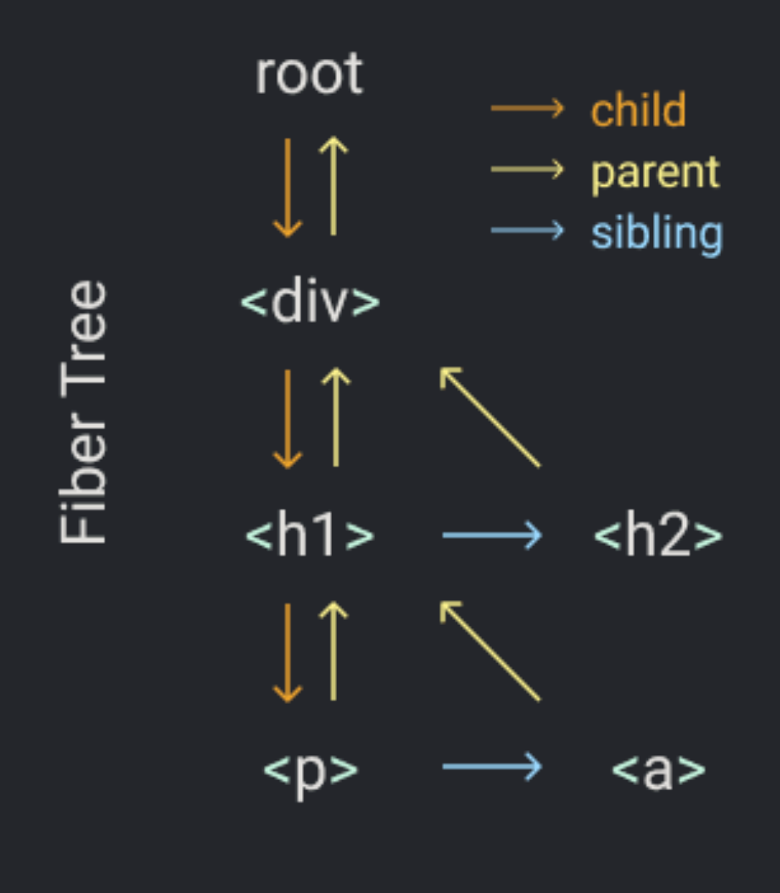

# Build your own React

我们要从下面几个步骤来创建一个`React`

- 第一步：`createElement`函数
- 第二步：`render`函数
- 第三步：`concurrent`模式
- 第四步：`Fiber`
- 第五步：渲染`Render`以及`Commit`阶段
- 第六步：函数组件
- 第七步：`Hooks`

## 第 0 步：回顾

```jsx
// 定义 react 中的元素 element
const element = <h1 title="foo">Hello</h1>;
// 定义挂载容器
const container = document.getElementById("root");
// 将元素渲染进入挂载容器中
ReactDOM.render(element, container);
```

上面三行是在我们使用`react`时必要的代码

在上面的第一步中，定义`react`中的元素`element`，其中`<h1>`并不是一个合法的`JavaScript`，所以我们需要使用合法的`JS`来代替它

`JSX`通过像`Babel`类的构建工具，将其转换为`JS`，转换规则也是简单的：使用`createElement`代替，传递进入`tag`名称以及相应地`props`和`children`作为参数，如下：

```js
const element = <h1 title="foo">hello</h1>;

// 转换为
const element = React.createElement(
  "h1",
  {
    title: "foo",
  },
  "hello"
);
```

`createElement`所做的就是，一些基本的校验，以及从传入的参数中创建一个对象。如，上面的`element`为下面的对象

```js
const element = {
  type: "h1",
  props: {
    title: "foo",
    children: "hello",
  },
};
```

`element`是一个有两个对象的属性，`type`以及`props`（其实还有更多，但是现在只需要关心这两个即可。）

- `type`是一个字符串，用来指定我们想创建的`DOM`节点的类型，它是当要使用`document.createElement`创建`DOM`时传递给这个函数的`tagName`。该字段也可以是一个函数。当我们使用函数组件时，这个`type`类型也就为一个函数。

- `props`是另一个对象。它包含了`JSX`中的所有的`keys`以及`values`，也包含其中的`children`。

- `children`：在当前的例子中是一个字符串，但是常见情况下，是一个数组

> 除了上面的`JSX`，另一方面我们需要替换为我们自己的函数的为`render`

`render`函数是`React`用来改变`DOM`的地方，因此我们可以使用我们自己的方式来进行更新。使用`DOM`操作`API`来向页面中插入即可

```javaScript
const node = document.createElement(element.type);
node["title"] = element.props.title;
const text = document.createTextNode("");
text.nodeValue = element.props.children;
node.appendChild(text);
container.appendChild(node);
```

所以上面实现了将`JSX`转换为`JS`，并将其根据`type`类型生成对应`DOM`节点，并插入到页面中的过程。

## 第一步：`createElement`函数

在上面中可以看到，需要使用`createElement`函数，生成一个`React`中的`element`

```js
const element = React.createElement(
  "div",
  { id: "foo" },
  React.createElement("a", null, "bar"),
  React.createElement("b")
);
```

其`createElement`函数主要是创建了一个`element`对象，用来对相应的`DOM`节点进行描述，主要有`type`以及`props`属性。所以我们可以根据这个进行`createElement`的编写

比如：`createElement("div")`返回：

```js
{
  "type": "div",
  "props": { "children": [] }
}
```

`createElement("div", null, a)`返回：

```js
{
  "type": "div",
  "props": { "children": [a] }
}
```

`createElement("div", null, a, b)`返回：

```js
{
  "type": "div",
  "props": { "children": [a, b] }
}
```

传入`children`中的数组的值类型，即可以是一个字符串，数字，也可以是一个`element`对象，如

```js
{
  "type": "div",
  "props": {
    "children": [
      {
        "type": "div",
        "props": { "children": [a, b] }
      },
      b
    ]
  }
}
```

如果值的类型为字符串以及数字，那么会创建一个`TEXT_ELEMENT`类型来指定其为文本类型节点（注意 📢： `React`源码中没有对原始值以及数组为空的情况进行处理，但是我们为了简化我们的代码，做了该处理。）

```js
function createElement(type, props, ...children) {
  return {
    type,
    props: {
      ...props,
      children,
    },
  };
}
```

添加`TEXT_ELEMENT`类型节点的处理逻辑：

```js
function createElement(type, props, ...children) {
  return {
    type,
    props: {
      ...props,
      children: children.map((child) =>
        typeof child === "object" ? child : createTextElement(child)
      ),
    },
  };
}

function createTextElement(text) {
  return {
    type: "TEXT_ELEMENT",
    props: { nodeValue: text, children: [] },
  };
}
```

为了与`React`代码进行区分，将我们其命名为：`Deact`，如下：

```js
const Deact = {
  createElement,
  createTextElement,
};
```

## 第二步：`render`函数

现在，我们来创建`render`函数

```js
function render(element, container) {
  const dom = document.createElement(element.type);
  // 遍历 element.props 中的属性，并将其添加到 node 中
  Object.keys(element.props).forEach((key) => {
    dom[key] = element.props[key];
  });
  // 遍历 element.props.children 中的元素，并将其添加到 node 中
  element.props.children.forEach((child) => {
    render(child, dom);
  });
  container.appendChild(dom);
}
```

需要对文本类型节点做特殊处理:

```js
function render(element, container) {
  const dom =
    element.type === "TEXT_ELEMENT"
      ? document.createTextNode("")
      : document.createElement(element.type);
  // 遍历 element.props 中的属性，并将其添加到 node 中
  Object.keys(element.props).forEach((key) => {
    if (key !== "children") {
      dom[key] = element.props[key];
    }
  });
  // 遍历 element.props.children 中的元素，并将其添加到 node 中
  element.props.children.forEach((child) => {
    render(child, dom);
  });
  container.appendChild(dom);
}
```

## 第三步：`Concurrent`模式

上面的递归调用有一个问题。

一旦我们开始渲染，直到我们渲染完成整个`DOM`树，这个渲染过程不会停止。如果这个树非常大，那么会阻塞主线程很长时间。**如果浏览器有一些如处理用户输入或者动画类的高优先级任务，则必须要等待整个渲染完成才能执行。**这是非常不友好的，会给用户造成非常不好的体验。

我们为了解决这个问题，需要做下面 👇🏻 几件事：

1. 将`render`中不能中断的渲染大任务，拆解为可以中断的小任务
2. 确定当前浏览器是否有空余时间
3. 需要有一个机制，在有空余时间时，可以进行循环执行，直到任务执行完成
4. 需要一个全局变量，保存下一次需要执行的任务。可以将任务接着执行

### 实现循环机制

```js
// 将大任务拆分为小任务的循环执行机制
let nextUnitOfWork = null; // 全局变量，保存接下来需要执行的任务
function workLoop(deadline) {
  let shouldYield = false; // 判断浏览器是否有剩余时间
  while (nextUnitOfWork && !shouldYield) {
    // 在一个requestIdleCallback中，有后续任务并且浏览器有剩余时间，则继续执行
    nextUnitOfWork = performUnitOfWork(nextUnitOfWork);
    // 执行完一个任务后，判断是否有空余时间，如果没空余时间，则停止循环，将当前变量存储在nextUnitWork中
    shouldYield = deadline.timeRemaining() < 1;
  }
  // 继续监听下一个浏览器空余时间
  requestIdleCallback(workLoop);
}

requestIdleCallback(workLoop);
```

可以使用`requestIdleCallback`来创建一个`loop`循环，可以将`requestIdleCallback`作为一个`setTimeout`。

浏览器在空闲时会调用传入`requestIdleCallback`的回调函数，并向其中传入`deadline`变量，该变量可以获取实时的剩余时间。

`React`内部不在使用`requestIdleCallback`，而是使用`scheduler`调度器。但是在这个例子中，我们的核心不在调度部分，所以仍然使它。

`requestIdleCallback`会传入回调函数一个`deadline`参数，我们可以使用这个参数来判断到浏览器再次控制还剩余多少时间

## 第四步：Fibers

为了组织工作单元，我们需要一种数据结构（可以保存当前执行的上下文以及可以随时进行中断）：`fiber`树

我们将针对每一个`element`都有一个对应的`fiber`，每一个`fiber`将成为一个工作单元

如果我们想渲染下面的`element`树

```ts
Deact.render(
  <div>
    <h1>
      <p></p>
      <a></a>
    </h1>
    <h2></h2>
  </div>,
  container
);
```

在`render`中，我们将创建根`RootFiber`以及将其设置为`nextUnitOfWork`。其他的工作将在`performUnitWork`函数中发生，我们针对每一个`fiber`节点将会做下面三件事：

1. 增加一个插入到`DOM`的元素`element`
2. 为`element`的子孙创建`fiber`
3. 选择下一个工作单元



这种数据结构的一个目的就是**更加容易的发现下一个工作单元**，那就是为什么每一个`fiber`都有一个链接指向它的第一个子元素，它的下一个兄弟元素以及它的父级元素

当完成一个`fiber`的工作，如果它存在子节点，那么这个子节点的`fiber`将成为下一个工作单元

在我们上图的例子中，当我们完成`div`的`fiber`的工作，那么下一个工作单元就是`h1`的`fiberNode`

如果这个`fiberNode`没有子节点，那么会使用`sibling`的`fiberNoode`作为下一个工作单元

在我们上图的例子中，`p`的`fiberNode`执行完成后，没有`child`的`fiberNode`，那么将返回`a`的`fiberNode`作为下一个工作单元

如果一个`fiberNode`既没有`child`的`fiberNode`，也没有`sibling`的`fiberNode`，那就就会去寻找`uncle`叔叔节点的`fiberNode`，也就是`sibling`的`parent`节点

如上图中的`a`以及`h2`节点

如果`parent`的`fiberNode`没有`sibling`节点，那么会继续向上查找`parent`的`fiberNode`直到发现一个`sibling`节点，或者直到到达顶层的`root`节点。如果到达`root`节点，那么意味着我们已经完成了这次`perform`渲染的所有工作

让我们根据上面的思想来进行代码改造：

将`render`中与创建`DOM`相关的代码单独封装为一个函数，如下：

```js
function createDom(fiber) {
  const dom =
    fiber.type === "TEXT_ELEMENT"
      ? document.createTextNode("")
      : document.createElement(fiber.type);
  const isProperty = (key) => key !== "children";
  Object.keys(fiber.props)
    .filter(isProperty)
    .forEach((name) => {
      dom[name] = fiber.props[name];
    });
  return dom;
}
```

在`render`函数中，我们将设置`nextUnitOfWork`为`fiber`树的根节点

```js
function render(element, container) {
  nextUnitOfWork = {
    dom: container,
    props: {
      children: [element],
    },
  };
}
```

然后，当浏览器准备好时，它将会调用过`workLoop`函数，然后将从`root`节点开始工作.

下面，我们需要来完`performUnitOfWork`函数，首先，我们创建一个新的`node`，并将其插入到`DOM`中。我们通过`fiber.dom`属性去会追踪其`DOM`的`node`节点

```js
function performUnitOfWork(fiber) {
  // create new node and append it to the DOM
  if (!fiber.dom) {
    fiber.dom = createDom(fiber);
  }
  if (fiber.parent) {
    fiber.parent.dom.appendChild(fiber.dom);
  }
}
```

然后，对于每一个`child`，我们将会创建其对应的`fiber`节点，然后将其`fiber`对应的`child`以及`sibling`指向对应的`fiberNode`节点

```js
function performUnitOfWork(fiber) {
  // ...add dom node
  // create new fibers
  const elements = fiber.props.children;
  let index = 0;
  let prevSibling = null;
  while (index < elements.length) {
    const element = elements[index];
    const newFiber = {
      type: element.type,
      props: element.props,
      parent: fiber,
      dom: null,
    };
    // child指向第一个子节点
    if (index === 0) {
      fiber.child = newFiber;
      newFiber.parent = fiber;
    } else {
      // 循环建立sibling连接
      prevSibling.sibling = newFiber;
      newFiber.parent = fiber;
    }
    prevSibling = newFiber;
    index++;
  }
}
```

最后，我们需要返回数据以供下一个工作单元使用，按照上面 👆🏻 的过程，我们首先返回`child`，然后是`sibling`，最后是`uncle`等等

```js
function performUnitOfWork(fiber) {
  // ...add dom node
  // ...create new fibers

  // 如果有子节点，则直接返回
  if (fiber.child) {
    return fiber.child;
  }
  // 查找sibling节点，如果存在则返回，否则返回parent的sibling节点
  let nextFiber = fiber;
  while (nextFiber) {
    if (nextFiber.sibling) {
      return nextFiber.sibling;
    }
    nextFiber = nextFiber.parent;
  }
  return null;
}
```

## 第五步：`Render`和`Commit`阶段

上面的代码实现了生成`fiber`以及根据`fiber`生成对应的`DOM`，并将其插入到页面中。但是这样也会造成其他的问题。

我们每次对一个`fiber`进行`perform`的时候，都会创建一个新的`DOM`，并将其插入到`DOM`中。并且由于我们的执行过程可以被浏览器的高优先级任务中断，在这种情况下，用户会看到没有渲染完成的`UI`。这是非常不友好的。

根据我们上面的代码，我们需要将其挂载插入`DOM`的部分移除

除此之外，还需要追踪`fiber`树的跟节点，我们将其称为`workInProgress`或者`wipRoot`

```js
function render(element, container) {
  wipRoot = {
    dom: container,
    props: {
      children: [element],
    },
  };
  nextUnitOfWork = wipRoot;
}

// 全局变量，保存接下来需要执行的任务
let nextUnitOfWork = null;
let wipRoot = null;
```

当执行完所有的`perform`后，再将整个`fiber`树一起提交到`DOM`中，修改为如下代码：

```js
function workLoop(deadline) {
  let shouldYield = false;
  while (nextUnitOfWork && !shouldYield) {
    nextUnitOfWork = performUnitOfWork(nextUnitOfWork);
    shouldYield = deadline.timeRemaining() < 1;
  }
  // 当nextUnitOfWork的值为Null的时候，代表已经完成了整个fiber树的perform过程
  if (!nextUnitOfWork && wipRoot) {
    commitRoot();
  }
  requestIdleCallback(workLoop);
}
```
