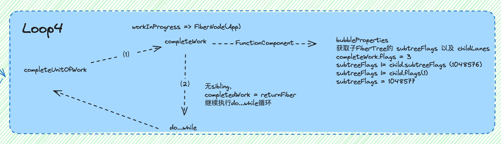
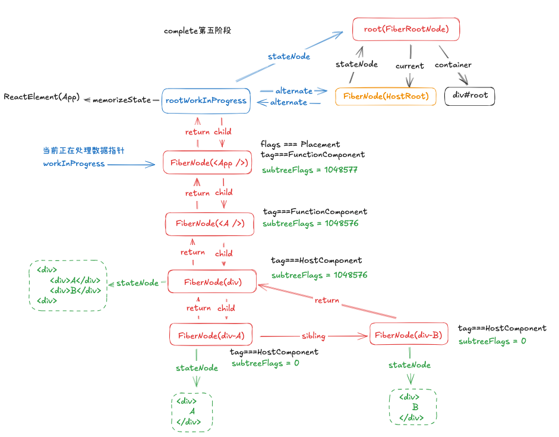

# react内部的初始化挂载

现在下面有如下页面渲染代码：

```html
<!DOCTYPE html>
<html>
<head>
    <meta charset="UTF-8">
    <title>React in HTML</title>
    <script src="./react.development.js"></script>
    <script src="./react-dom.development.js"></script>
    <script crossorigin src="https://unpkg.com/@babel/standalone/babel.min.js"></script>
</head>
<style>
  .component {
    border: 1px solid #ccc;
    padding: 10px;
    margin: 10px;
  }
</style>
<body>
  <div id="root"></div>

  <!-- 使用 type="text/babel" 让 Babel 编译 JSX -->
  <script type="text/babel">

    function A() {
      return (
        <div className="component" data-name="A">
          <div>A</div>
          <div>B</div>
        </div>
      );
    }


    // 创建 React 组件
    function App() {
      return (
        <A />
      );
    }

    // 渲染组件到 DOM
    const root = ReactDOM.createRoot(document.getElementById('root'));
    root.render(<App />);
  </script>
</body>
</html>
```

## Fiber结构介绍

上面的代码大概是如下的层级结构：

```jsx
<App>
    <A>
        <div>
            <div>A</div>
            <div>B</div>
        </div>
    </A>
</App>
```

上面的结构在`React`中会构建如下图的一个`FiberTree`


从上图中可以看到，在该`FiberTree`中一共包含2种不同的类型：

- `FiberRootNode`: `FiberRootNode` 是一个特殊节点，充当 `React` 的根节点，它保存着整个应用程序所需的元数据。其 `current` 属性指向实际的 `Fiber` 树结构，每次构建新的 `Fiber` 树时，它都会将 `current` 重新指向新的 `HostRoot`。
- `FiberNode`: `react`内部中对结点的一种表示，包含很多属性可以对其结点进行描述
  - `tag`: `FiberNode`有许多不同的子类型，在`render`以及`commit`阶段会根据该值进行不同的处理，如`HostRoot`、`FunctionComponent`、`ClassComponent`、`HostComponent`等等
  - `stateNode`: 对于`tag`为`HostComponet`的`FiberNode`，其指向页面中实际渲染的`DOM`节点
  - `child`、`sibling`、`return`: 分别指向子节点，兄弟节点以及父节点，用于构造完整`Fiber`树
  - `flags`: 用于表示在 `commit` 阶段需要更新的类型。subtreeFlags 表示其子树需要更新的类型

上面对于`FiberNode`的属性介绍只包含当前初始化页面所需要的属性，其他属性在后面需要用到时再进行解释。

## 大致过程

我们先来把整个渲染过程进行一个粗略的介绍，我们在渲染页面时，会执行下面的代码

```jsx
const root = ReactDOM.createRoot(document.getElementById('root'));
root.render(<App />);
```

上面的代码中，分为了以下两个主要过程：

1. `createRoot`
2. `render`

### `createRoot`

上面的`createRoot`会创建一个`FiberRootNode`

```jsx
function createRoot(container, options) {
    var root = createContainer(container, ConcurrentRoot, null, isStrictMode, concurrentUpdatesByDefaultOverride, identifierPrefix, onRecoverableError);
    return new ReactDOMRoot(root);
  }

function createContainer(containerInfo, tag, hydrationCallbacks, isStrictMode, concurrentUpdatesByDefaultOverride, identifierPrefix, onRecoverableError, transitionCallbacks) {
    var hydrate = false;
    var initialChildren = null;
    return createFiberRoot(containerInfo, tag, hydrate, initialChildren, hydrationCallbacks, isStrictMode, concurrentUpdatesByDefaultOverride, identifierPrefix, onRecoverableError);
  }


function createFiberRoot(containerInfo, tag, hydrate, initialChildren, hydrationCallbacks, isStrictMode, concurrentUpdatesByDefaultOverride, identifierPrefix, onRecoverableError, transitionCallbacks) {
    var root = new FiberRootNode(containerInfo, tag, hydrate, identifierPrefix, onRecoverableError);
    var uninitializedFiber = createHostRootFiber(tag, isStrictMode);
    root.current = uninitializedFiber;
    uninitializedFiber.stateNode = root;
    return root;
  }
```

上面代码的大致执行流程如下：


执行完成后，会创建一个`FiberRootNode`，保存在`ReactDomRoot`实例的`this._internalRoot`中，充当 `React` 的根节点，它保存着整个应用程序所需的元数据。其 `current` 属性指向实际的 `Fiber` 树结构，每次构建新的 `Fiber` 树时，它都会将 `current` 重新指向新的 `HostRoot`。

当前的`root`属性如下：



上图中的`root`为当前`ReactDOMRoot`的实例，内部`_internalRoot`为当前实例的`FiberRootNode`，其`current`指向当前页面的`FiberNode`节点。其中`tag`的值为`3`，表示`FiberNode`的节点类型为`HostRoot`。



### render

在`render`过程中主要执行了下面内容：

```jsx
ReactDOMRoot.prototype.render = function (children) {
  var root = this._internalRoot;
  updateContainer(children, root, null, null);
};

function updateContainer(element, container, parentComponent, callback) {
  // some other code...
  var update = createUpdate(eventTime, lane);
  update.payload = {
    element: element
  };
  callback = callback === undefined ? null : callback;
  var root = enqueueUpdate(current$1, update, lane);

  if (root !== null) {
    // 进入调度器 schedule
    scheduleUpdateOnFiber(root, current$1, lane, eventTime);
  }
  return lane;
}

function scheduleUpdateOnFiber(root, fiber, lane, eventTime) {
  if ((executionContext & RenderContext) !== NoLanes && root === workInProgressRoot) {
    // some code...
  } else {
    // 确保FiberRootNode被调度
    ensureRootIsScheduled(root, eventTime);
  }
}

function ensureRootIsScheduled(root, currentTime) {
  // some code...
  // 获取更新优先级，拿取最高级别的优先级任务进行执行
   scheduleSyncCallback(performSyncWorkOnRoot.bind(null, root));
}

function performSyncWorkOnRoot(root) {
    var exitStatus = renderRootSync(root, lanes);
    var finishedWork = root.current.alternate;
    root.finishedWork = finishedWork;
    root.finishedLanes = lanes;
    commitRoot(root, workInProgressRootRecoverableErrors, workInProgressTransitions);
    return null;
  }
```

上面的代码可以概括为下面的流程图：


其中`scheduleUpdateOnFiber`、`ensureRootIsScheduled`以及`scheduleSyncCallback`都是调度相关的函数，本章的重点是渲染，先暂时跳过这些内容，后期调度相关会详细讲解。渲染相关的核心函数为`performSyncWorkOnRoot`，以及`performConcurrentWorkOnRoot`函数，`performSyncWorkOnRoot`为**同步模式**，`performConcurrentWorkOnRoot`为**并发模式**

#### 同步模式

```text
performSyncWorkOnRoot
    ↓
renderRootSync  // 同步渲染根节点
    ↓
workLoopSync    // 同步工作循环（不可中断）
    ↓
completeUnitWork // 完成单元工作
    ↓
commitRoot      // 提交变更到DOM
```

#### 并发模式

```text
performConcurrentWorkOnRoot
    ↓
renderRootConcurrent  // 并发渲染根节点
    ↓
workLoopConcurrent    // 并发工作循环（可中断）
    ↓
shouldYield? → 是 → 暂停并返回
    ↓
completeUnitWork
    ↓
commitRoot
```

上面的同步模式与并发模式的主要区别为渲染根节点的过程，**同步模式**创建`FiberTree`的过程**不可中断**，**并发模式**则可以被**高优先级任务中断**，而`commitRoot`过程则是一致都，都是同步执行。
