# react内部的初始化挂载

现在下面有如下页面渲染代码：

```html
<!DOCTYPE html>
<html>
<head>
    <meta charset="UTF-8">
    <title>React in HTML</title>
    <script src="./react.development.js"></script>
    <script src="./react-dom.development.js"></script>
    <script crossorigin src="https://unpkg.com/@babel/standalone/babel.min.js"></script>
</head>
<style>
  .component {
    border: 1px solid #ccc;
    padding: 10px;
    margin: 10px;
  }
</style>
<body>
  <div id="root"></div>

  <!-- 使用 type="text/babel" 让 Babel 编译 JSX -->
  <script type="text/babel">

    function A() {
      return (
        <div className="component" data-name="A">
          <div>A</div>
          <div>B</div>
        </div>
      );
    }


    // 创建 React 组件
    function App() {
      return (
        <A />
      );
    }

    // 渲染组件到 DOM
    const root = ReactDOM.createRoot(document.getElementById('root'));
    root.render(<App />);
  </script>
</body>
</html>
```

## Fiber结构介绍

上面的代码大概是如下的层级结构：

```jsx
<App>
    <A>
        <div>
            <div>A</div>
            <div>B</div>
        </div>
    </A>
</App>
```

上面的结构在`React`中会构建如下图的一个`FiberTree`


从上图中可以看到，在该`FiberTree`中一共包含2种不同的类型：

- `FiberRootNode`: `FiberRootNode` 是一个特殊节点，充当 `React` 的根节点，它保存着整个应用程序所需的元数据。其 `current` 属性指向实际的 `Fiber` 树结构，每次构建新的 `Fiber` 树时，它都会将 `current` 重新指向新的 `HostRoot`。
- `FiberNode`: `react`内部中对结点的一种表示，包含很多属性可以对其结点进行描述
  - `tag`: `FiberNode`有许多不同的子类型，在`render`以及`commit`阶段会根据该值进行不同的处理，如`HostRoot`、`FunctionComponent`、`ClassComponent`、`HostComponent`等等
  - `stateNode`: 对于`tag`为`HostComponet`的`FiberNode`，其指向页面中实际渲染的`DOM`节点
  - `child`、`sibling`、`return`: 分别指向子节点，兄弟节点以及父节点，用于构造完整`Fiber`树
  - `flags`: 用于表示在 `commit` 阶段需要更新的类型。subtreeFlags 表示其子树需要更新的类型

上面对于`FiberNode`的属性介绍只包含当前初始化页面所需要的属性，其他属性在后面需要用到时再进行解释。

## 大致过程

我们先来把整个渲染过程进行一个粗略的介绍，我们在渲染页面时，会执行下面的代码

```jsx
const root = ReactDOM.createRoot(document.getElementById('root'));
root.render(<App />);
```

上面的代码中，分为了以下两个主要过程：

1. `createRoot`
2. `render`

### `createRoot`

上面的`createRoot`会创建一个`FiberRootNode`

```jsx
function createRoot(container, options) {
    var root = createContainer(container, ConcurrentRoot, null, isStrictMode, concurrentUpdatesByDefaultOverride, identifierPrefix, onRecoverableError);
    return new ReactDOMRoot(root);
  }

function createContainer(containerInfo, tag, hydrationCallbacks, isStrictMode, concurrentUpdatesByDefaultOverride, identifierPrefix, onRecoverableError, transitionCallbacks) {
    var hydrate = false;
    var initialChildren = null;
    return createFiberRoot(containerInfo, tag, hydrate, initialChildren, hydrationCallbacks, isStrictMode, concurrentUpdatesByDefaultOverride, identifierPrefix, onRecoverableError);
  }


function createFiberRoot(containerInfo, tag, hydrate, initialChildren, hydrationCallbacks, isStrictMode, concurrentUpdatesByDefaultOverride, identifierPrefix, onRecoverableError, transitionCallbacks) {
    var root = new FiberRootNode(containerInfo, tag, hydrate, identifierPrefix, onRecoverableError);
    var uninitializedFiber = createHostRootFiber(tag, isStrictMode);
    root.current = uninitializedFiber;
    uninitializedFiber.stateNode = root;
    return root;
  }
```

上面代码的大致执行流程如下：
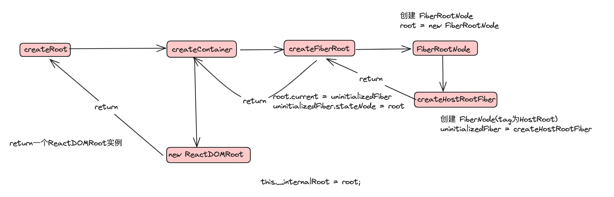

执行完成后，会创建一个`FiberRootNode`，保存在`ReactDomRoot`实例的`this._internalRoot`中，充当 `React` 的根节点，它保存着整个应用程序所需的元数据。其 `current` 属性指向实际的 `Fiber` 树结构，每次构建新的 `Fiber` 树时，它都会将 `current` 重新指向新的 `HostRoot`。生成如下`FiberTree`结构：
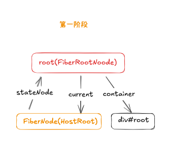

当前的`root`属性如下：


上图中的`root`为当前`ReactDOMRoot`的实例，内部`_internalRoot`为当前实例的`FiberRootNode`，其`current`指向当前页面的`FiberNode`节点。其中`tag`的值为`3`，表示`FiberNode`的节点类型为`HostRoot`。


### render

在`render`过程中主要执行了下面内容：

```jsx
ReactDOMRoot.prototype.render = function (children) {
  var root = this._internalRoot;
  updateContainer(children, root, null, null);
};

function updateContainer(element, container, parentComponent, callback) {
  // some other code...
  var update = createUpdate(eventTime, lane);
  update.payload = {
    element: element
  };
  callback = callback === undefined ? null : callback;
  var root = enqueueUpdate(current$1, update, lane);

  if (root !== null) {
    // 进入调度器 schedule
    scheduleUpdateOnFiber(root, current$1, lane, eventTime);
  }
  return lane;
}

function scheduleUpdateOnFiber(root, fiber, lane, eventTime) {
  if ((executionContext & RenderContext) !== NoLanes && root === workInProgressRoot) {
    // some code...
  } else {
    // 确保FiberRootNode被调度
    ensureRootIsScheduled(root, eventTime);
  }
}

function ensureRootIsScheduled(root, currentTime) {
  // some code...
  // 获取更新优先级，拿取最高级别的优先级任务进行执行
   scheduleSyncCallback(performSyncWorkOnRoot.bind(null, root));
}

function performSyncWorkOnRoot(root) {
    var exitStatus = renderRootSync(root, lanes);
    var finishedWork = root.current.alternate;
    root.finishedWork = finishedWork;
    root.finishedLanes = lanes;
    commitRoot(root, workInProgressRootRecoverableErrors, workInProgressTransitions);
    return null;
  }
```

上面的代码可以概括为下面的流程图：


其中`scheduleUpdateOnFiber`、`ensureRootIsScheduled`以及`scheduleSyncCallback`都是调度相关的函数，本章的重点是渲染，先暂时跳过这些内容，后期调度相关会详细讲解。渲染相关的核心函数为`performSyncWorkOnRoot`，以及`performConcurrentWorkOnRoot`函数，`performSyncWorkOnRoot`为**同步模式**，`performConcurrentWorkOnRoot`为**并发模式**

#### 同步模式

```text
performSyncWorkOnRoot
    ↓
renderRootSync  // 同步渲染根节点
    ↓
workLoopSync    // 同步工作循环（不可中断）
    ↓
completeUnitWork // 完成单元工作
    ↓
commitRoot      // 提交变更到DOM
```

#### 并发模式

```text
performConcurrentWorkOnRoot
    ↓
renderRootConcurrent  // 并发渲染根节点
    ↓
workLoopConcurrent    // 并发工作循环（可中断）
    ↓
shouldYield? → 是 → 暂停并返回
    ↓
completeUnitWork
    ↓
commitRoot
```

上面的同步模式与并发模式的主要区别为渲染根节点的过程，**同步模式**创建`FiberTree`的过程**不可中断**，**并发模式**则可以被**高优先级任务中断**，而`commitRoot`过程则是一致都，都是同步执行。

上面代码可以看到`render`函数中执行了`renderRootSync`与`commitRoot`两个函数，也是`React`中比较重要的两个部分，一个是创建`FiberNode`以及对应的`stateNode`、`flags`、`subtreeFlags`,并生成`FiberTree`，另一个是根据前面创建的`FiberTree`，获取对应节点的`flags`以及`subtreeFlags`来进行对应的`DOM`节点挂载操作。

📢 注意：由于`commitRoot`是一次执行完成的挂载过程，为了避免浏览器产生闪烁以及重绘等，`React`内部进行了优化，也就是在`render`阶段，就将子树的整个`DOM`树构建完成了。下面会进行详细的解析：

#### renderRootSync

在`renderRootSync`函数中的核心为`do...while(true)`的执行`workLoopSync`函数

```jsx
function renderRootSync(root, lanes) {
  prepareFreshStack(root, lanes);
  do {
    try {
      workLoopSync();
      break;
    } catch (thrownValue) {
      handleError(root, thrownValue);
    }
  } while (true);
  workInProgressRoot = null;
  workInProgressRootRenderLanes = NoLanes;

  return workInProgressRootExitStatus;
}

function prepareFreshStack(root, lanes) {
    root.finishedWork = null;
    root.finishedLanes = NoLanes;

    workInProgressRoot = root;
    var rootWorkInProgress = createWorkInProgress(root.current, null);
    workInProgress = rootWorkInProgress;
    finishQueueingConcurrentUpdates();
    return rootWorkInProgress;
  }

function workLoopSync() {
  while (workInProgress !== null) {
    performUnitOfWork(workInProgress);
  }
}


function performUnitOfWork(unitOfWork) {
  var current = unitOfWork.alternate;
  setCurrentFiber(unitOfWork);
  var next;

  if ( (unitOfWork.mode & ProfileMode) !== NoMode) {
    next = beginWork(current, unitOfWork, subtreeRenderLanes);
  } else {
    next = beginWork(current, unitOfWork, subtreeRenderLanes);
  }

  resetCurrentFiber();
  unitOfWork.memoizedProps = unitOfWork.pendingProps;

  if (next === null) {
    completeUnitOfWork(unitOfWork);
  } else {
    workInProgress = next;
  }

  ReactCurrentOwner$2.current = null;
}
```

上面的代码中，主要实现了两部分重要内容：

- 1.创建`workInProgress`：`prepareFreshStack`函数将当前`FiberRootNode`类型的节点传入，使用其`root.current`属性创建`workInProgress`，`root.current`为当前容器的`FiberNode`节点，也就是`FiberNode(HostRoot)`
- 2.开启工作循环：`workLoopSync`以及`performUnitOfWork`函数实现了对`FiberTree`的创建，其中`beginWork`是创建`FiberNode`，`completeUnitOfWork`为创建`stateNode`并构建当前节点的`DOM`树的过程。

执行完上面的内容后，当前内存中的数据结构如下：


##### workLoopSync

下面是`beginWork`函数的主要内容，主要就是根据`fiberNode`的`tag`值执行不同的方法

```jsx
function beginWork(current, workInProgress, renderLanes) {
  workInProgress.lanes = NoLanes;

  switch (workInProgress.tag) {
    case IndeterminateComponent:
      {
        return mountIndeterminateComponent(current, workInProgress, workInProgress.type, renderLanes);
      }

    case FunctionComponent:
      {
        var Component = workInProgress.type;
        var unresolvedProps = workInProgress.pendingProps;
        var resolvedProps = workInProgress.elementType === Component ? unresolvedProps : resolveDefaultProps(Component, unresolvedProps);
        return updateFunctionComponent(current, workInProgress, Component, resolvedProps, renderLanes);
      }

    case HostRoot:
      return updateHostRoot(current, workInProgress, renderLanes);

    case HostComponent:
      return updateHostComponent(current, workInProgress, renderLanes);

    case HostText:
      return updateHostText(current, workInProgress);
  }
}
```

让我们从头进入该函数，了解一下执行过程，现在使用了如下的结构进行渲染：

```jsx
<App>
    <A>
        <div>
            <div>A</div>
            <div>B</div>
        </div>
    </A>
</App>
```

#### beginWork阶段

##### **第一次 workLoop**

函数执行过程如下图：
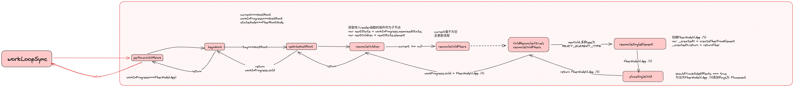

这是第一次`workLoop`循环，当前的`workInProgress === FiberNode(HostRoot)`，进入`beginWork`函数，根据当前`tag === 3`，进入`updateHostRoot`函数，然后进入`reconcileChildren`函数中，此时，会将 `<App />`被`babel`编译后的`ReactElement`对象作为`newChild`传入`reconcileChildFibers`作为函数，该函数为执行`ChildReconciler(true)`后返回的函数，也就是`ChildReconciler`函数中的闭包`reconcileChildFibers`函数，其中`shouldTrackSideEffects`参数为`true`。后面继续进入`reconcileSingleElement`函数，该函数的主要作用是创建`FiberNode(<App />)`，并将其`return`属性，指向当前`FiberNode(HostRoot)`。后续将当前新创建的`FiberNode(<App />)`作为参数传入`placeSingleChild`函数，添加`flags`，其`shouldTrackSideEffects === true`，则`FiberNode(<App />).flags === Placement`，执行到当前的内存数据接口如下：


然后从`placeSingleChild`依次从调用栈中进行返回，其中比较重要的就是在`reconcileChildren`函数中，将`workInProgress.child`属性指向了新创建的`FiberNode(<App />)`节点。此时结构如下：
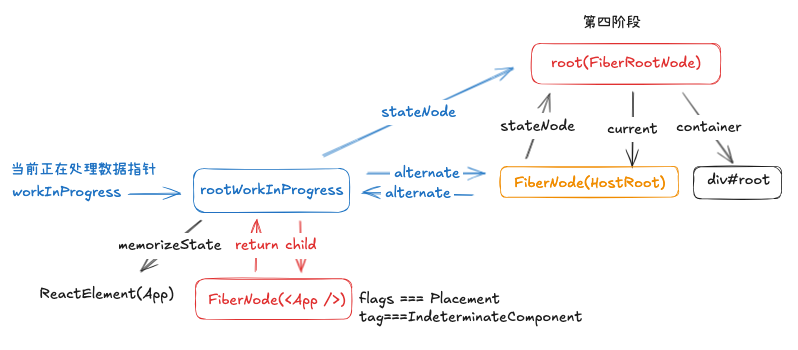

然后在`performUnitOfWork`函数中，将`workInProgress`指向了`FiberNode(<App />)`节点。此时结构如下：
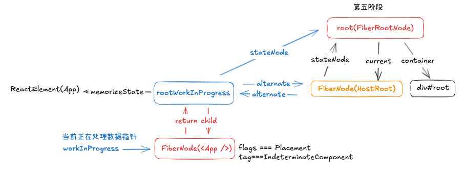

##### **第二次workLoop**

此时进入下一次`workLoopSync`循环，流程如下：
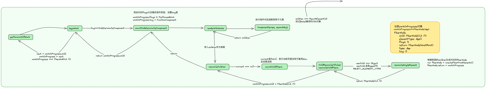

当前循环与上一次循环不同之处在于，此时的`FiberNode(<App />).tag === IndeterminateComponent`并且此时`workInProgress`的`current`为`null`，于是进入`mountIndeterminateComponent`函数，将该`FiberNode<App />.tag`修改为`FunctionComponent`，然后继续执行`renderWithHooks`函数，在该函数内，如果是函数组价，则获取其`type`，也就是函数来进行执行，执行完成后的返回值，传入`reconcileChildren`函数内，由于`current === null`，所以执行`mountChildFibers`函数，创建`FiberNode(<A />)`，当前数据结构如下：


在函数返回后逐渐返回调用栈中的函数，并在`reconcileChildren`函数中将`workInProgress.child`指向当前新的结点`FiberNode(<A />)`，并在`performUnitOfWork`函数中将当前新创建的结点指向`workInProgress`，当前数据结构如下:


##### **第三次workLoop**

继续执行第三次`workLoop`循环，流程如下：

当前循环与上次循环过程基本一致，除了生成的`FiberNode`的`tag === HostComponent`类型，这是在`createFiberFromTypeAndProps`函数中根据当前的`type`值决定的，当前`type === div`，表示为**宿主组件**，则将`tag = HostComponent`，当前数据结构如下：
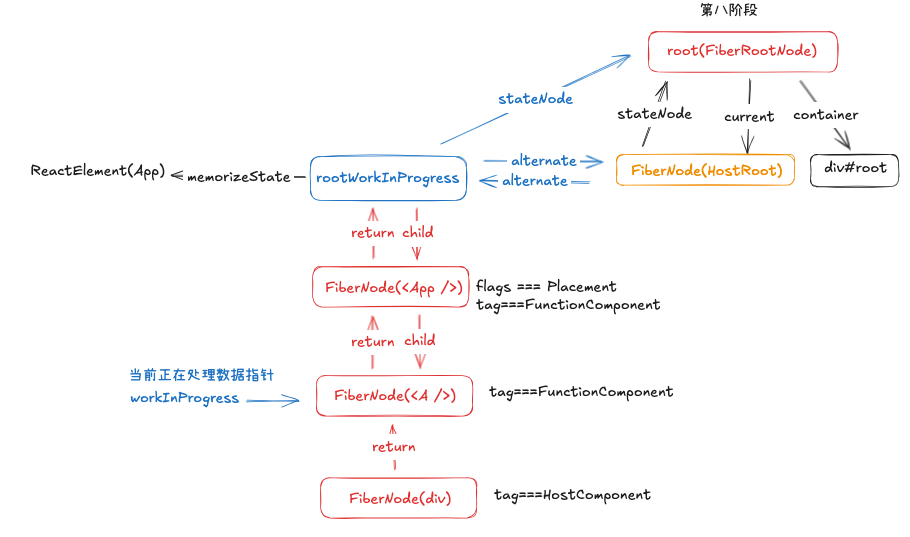
依次返回调用栈中的函数，本轮循环执行完成后数据结构如下：
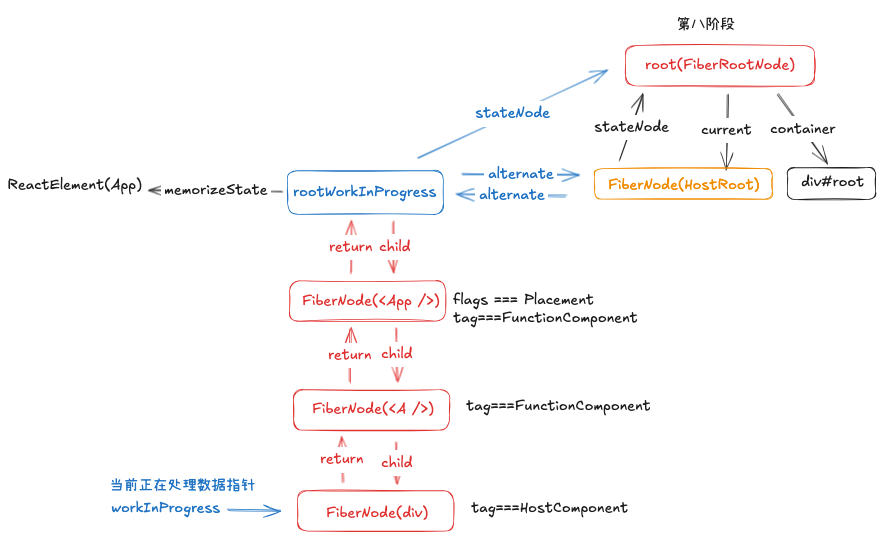

##### **第四次workLoop**


第四次循环流程如上图👆🏻，当前`workInProgress === FiberNode(div)`，则在`beginWork`函数中根据`tag === HostComponent`，会进入`updateHostComponent`函数，`babel`在编译时将`HostComponent`组件的子元素作为`children`属性放在了其`element.props`中，然后再创建`FiberNode`时，保存在了`FiberNode(div).pendingProps`属性中。如下代码：

```jsx
function createFiberFromElement(element, mode, lanes) {
  var type = element.type;
  var key = element.key;
  var pendingProps = element.props;
  var fiber = createFiberFromTypeAndProps(type, key, pendingProps, owner, mode, lanes);
  return fiber;
}
```

然后再`updateHostComponent`中执行下面代码，将其子元素传入了`reconcileChildren`函数

```jsx
var nextProps = workInProgress.pendingProps;
var prevProps = current !== null ? current.memoizedProps : null;
var nextChildren = nextProps.children;
```

执行到`reconcileChildFibers`函数内部，发现其`isArray(newChild) === true`，则执行了`reconcileChildrenArray`函数

```jsx
function reconcileChildrenArray(returnFiber, currentFirstChild, newChildren, lanes) {
  var resultingFirstChild = null;
  var previousNewFiber = null;
  var oldFiber = currentFirstChild;
  var lastPlacedIndex = 0;
  var newIdx = 0;
  var nextOldFiber = null;

  if (oldFiber === null) {
    for (; newIdx < newChildren.length; newIdx++) {
      var _newFiber = createChild(returnFiber, newChildren[newIdx], lanes);

      if (_newFiber === null) {
        continue;
      }

      lastPlacedIndex = placeChild(_newFiber, lastPlacedIndex, newIdx);

      if (previousNewFiber === null) {
        resultingFirstChild = _newFiber;
      } else {
        previousNewFiber.sibling = _newFiber;
      }

      previousNewFiber = _newFiber;
    }

    return resultingFirstChild;
  }
  return resultingFirstChild;
}
```

当前函数执行完成后的内存模型如下：
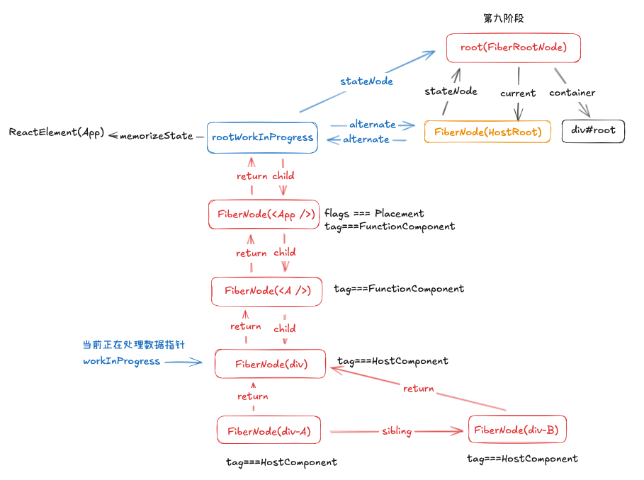
如上图所示，生成了对应的`FiberNode(div-A)`节点，以及`FiberNode(div-B)`节点，并将其通过`sibling`属性进行连接。并且它们的`return`节点都指向了`FiberNode(div)`节点。

后续依次返回调用栈中的函数，本轮循环执行完成后数据结构如下：
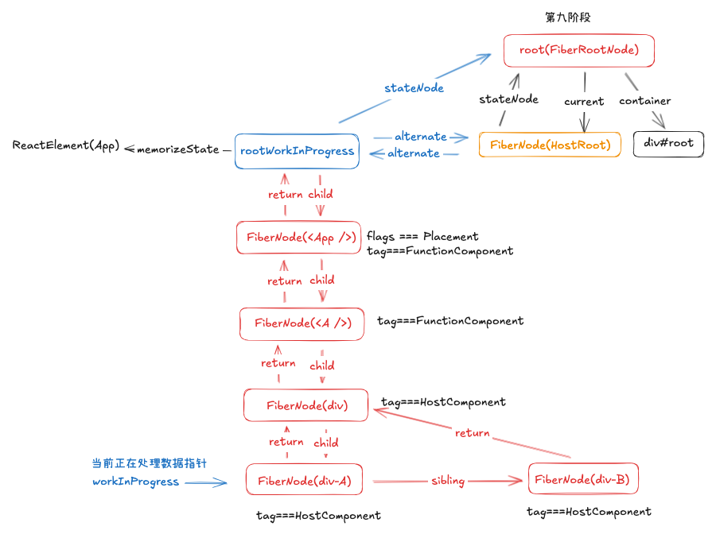

##### **第五次workLoop**

进入第五次`workLoop`循环中的`beginWork`函数，当前`workInProgress === FiberNode(div-A)`，流程如下：
，大致流程与上次循环一致，不同点为没有其子元素，函数返回的为`null`，其没有子节点，于是进入`performUnitOfWork`函数中的`completeUnitOfWork`函数。当前内存中数据结构如下：
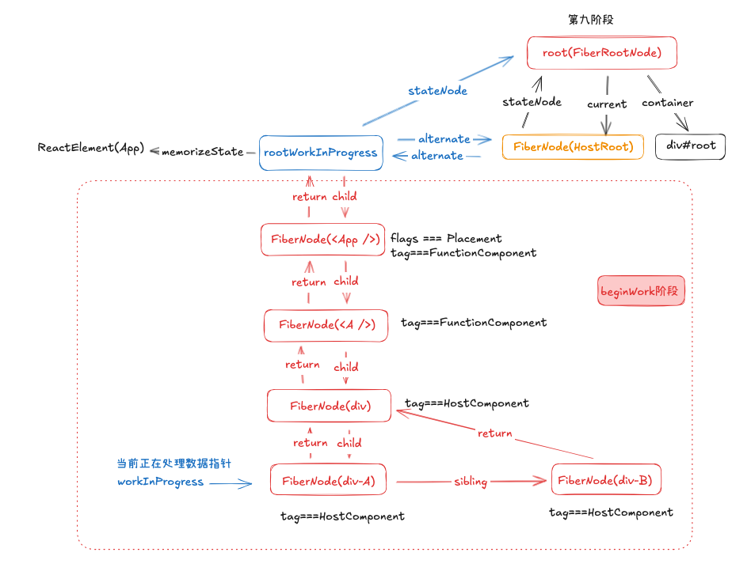
