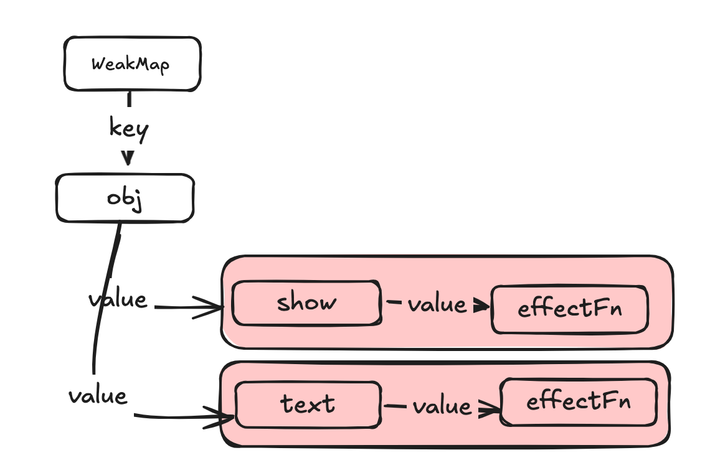
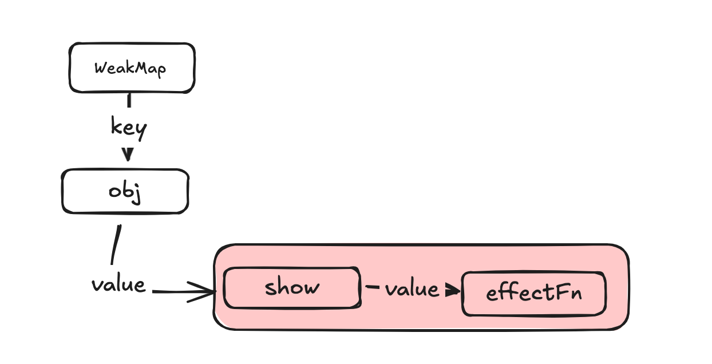

# 响应式的实现

> 我们都知道`Vue`是通过响应式来实现对状态的监听，实现精确的更新，减少性能消耗的，那么具体是怎么实现的呢？

## 响应式数据的基本实现

如何使数据变成响应式数据呢，大概可以发现以下两点：

- 当副作用函数`effect`执行的时候，会触发对应字段的读取操作
- 当修改对应字段的值时，会触发该字段的设置操作

如果可以拦截一个对象的读取和设置操作，就可以在读取该字段的时候，将对应副作用函数放在一个“桶”里，当设置值时，将“桶”里的所有副作用函数重新执行一遍，以便更新值

那么怎么能拦截一个对象属性的读取和设置操作呢？在`ES2015`之前，只能通过`Object.defineProperty`，在之后，可以使用代理对象`Proxy`来实现，使用`Object.defineProperty`与`Proxy`有什么不同的？可以看这里 [defineProperty VS Proxy](./defineProperty%20VS%20Porxy.md)

```js
const bucket = new WeakMap();

function effect() {
  console.log(obj.text);
}

// 原始数据
const data = {
  text: "hello world1",
};

// 对原始数据的代理
const obj = new Proxy(data, {
  // 拦截读取操作
  get(target, key) {
    // 没有当前激活的副作用函数 activeEffect，那么直接返回 return
    if (!activeEffect) return target[key];
    // 根据 target 从”桶“里取得 depMaps，它也是一个 Map 类型： key --> new Map()
    let depMaps = bucket.get(target);
    // 如果不存在 depMaps，那么新建一个 Map 并与 target 进行关联
    if (!depMaps) {
      bucket.set(target, (depMaps = new Map()));
    }
    // 根据 key 从 depMaps 中取得 deps，是一个 Set 类型，里面存储着所有与当前 key 相关联的副作用函数：effects
    let deps = depMaps.get(key);
    if (!deps) {
      depMaps.set(key, (deps = new Set()));
    }
    deps.add(activeEffect);
    return target[key];
  },
  set(target, key, value) {
    target[key] = value;
    const depMaps = bucket.get(target);
    if (!depMaps) return;
    const effects = depMaps.get(key);
    effects && effects.forEach((fn) => fn());
  },
});

effect(); // hello world

obj.text = "changeme1"; // changeme
```

## 副作用函数依赖的清除

当我们使用上面的方式，向`backet`桶里添加了对应对象`key`的副作用函数，如果在下一次页面更新后，状态值被修改了，该依赖函数不需要被收集进入`backet`中，是如何进行删除的呢？

比如现在有一个副作用函数，内部有一个三目条件运算符，当值状态不同时，其应该收集的依赖也是不尽相同的

```js
effect(function effectFn() {
  document.body.innerHTML = obj.show ? obj.text : "123";
});
```

当最开始`obj.show`的值为`true`时，依赖关系如下，可以看到副作用函数`effectFn`分别被字段`obj.show`以及`obj.text`所对应的依赖集合收集



当`obj.show`的值为`false`时，由于此时`obj.text`的值不会被读取，所以希望当前的副作用关系如下：



那么要解决这个问题，就需要在每次收集副作用函数前，将当前的副作用函数从所有依赖的集合中删除掉，再在后面读取相应变量值依赖的副作用函数时，再进行依赖收集

```js
let activeEffect = null;
function effect(fn) {
  const effectFn = () => {
    // 调用cleanup函数完成清除工作
    cleanup(effectFn);
    activeEffect = effectFn;
    fn();
  };
  effectFn.deps = [];
  effectFn();
}

function cleanup(effectFn) {
  // 遍历effectFn.deps数组
  for (let i = 0; i < effectFn.deps.length; i++) {
    const deps = effectFn.deps[i];
    // 将effectFn从依赖集合中移除
    deps.delete(effectFn);
  }
  // 重置`effectFn.deps`数组
  effectFn.deps.length = 0;
}

function track(target, key) {
  // 没有当前激活的副作用函数 activeEffect，那么直接返回 return
  if (!activeEffect) return target[key];
  // 根据 target 从”桶“里取得 depMaps，它也是一个 Map 类型： key --> new Map()
  let depMaps = bucket.get(target);
  // 如果不存在 depMaps，那么新建一个 Map 并与 target 进行关联
  if (!depMaps) {
    bucket.set(target, (depMaps = new Map()));
  }
  // 根据 key 从 depMaps 中取得 deps，是一个 Set 类型，里面存储着所有与当前 key 相关联的副作用函数：effects
  let deps = depMaps.get(key);
  if (!deps) {
    depMaps.set(key, (deps = new Set()));
  }
  deps.add(activeEffect);
  // deps就是一个与当前副作用函数存在联系的依赖集合
  activeEffect.deps.push(deps);
}
```

从上面的代码中，可以看到，我们将副作用函数的依赖添加到副作用函数`effectFn`的静态属性数组`deps`中，每次在执行副作用函数之前，会调用`cleanup`函数将所有的相关依赖进行删除

## 嵌套的副作用函数
